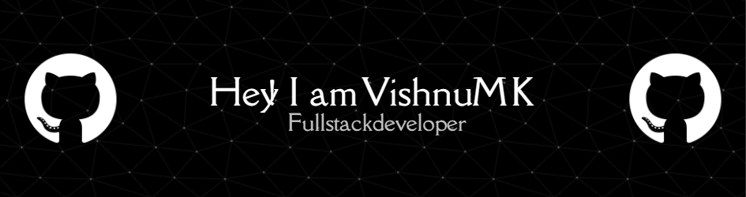

# 💫 About Me:

💻 MERN Stack 🧑‍💻 Self and Quick learner ⌚ Time Management

## 🌐 Socials:
  

# 💻 Tech Stack:
                                         
# 📊 GitHub Stats:
 
 

## 🏆 GitHub Trophies

### ✍️ Random Dev Quote

### 🔝 Top Contributed Repo

---

  ## 💰 You can help me by Donating
   

  
<!-- Proudly created with GPRM ( https://gprm.itsvg.in ) -->
